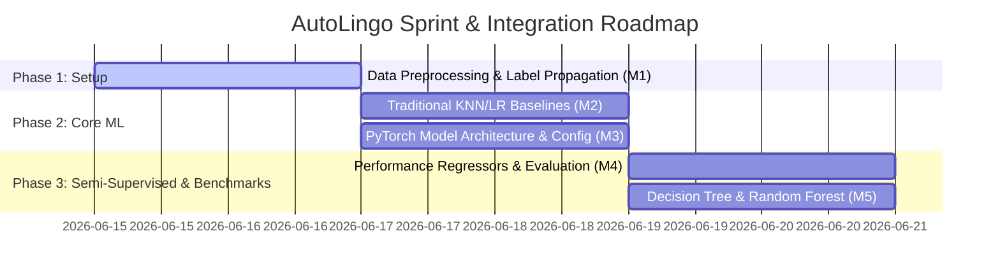

# 🚀 AutoLingo — Team Architecture & Role Specification

> **Project:** AutoLingo — AI-Powered Smart Text Autocomplete Engine
> **Architecture:** PyTorch Embedding-to-Linear Neural Predictor
> **ML Coverage:** Naive Bayes, Label Propagation, KNN, Logistic Regression, Neural Networks, Linear Regression, Polynomial Regression, Decision Tree, Random Forest
> **Deadline:** End of June 2026

This document defines the complete role architecture for AutoLingo. Each member owns a distinct ML pipeline with zero algorithm overlap. Member 3 (Harsha) operates as a fully independent neural module ("Lego block"). Members 2 and 5 form a collaborative pair consuming shared data but employing different algorithms. Members 1 and 4 operate independently. All presentation and documentation duties are shared equally.

---

## 👥 Shared Responsibilities (All Members)
*   **Report**: Every member writes 2–3 pages describing their own module design, equations used, and structural code logic.
*   **Slides**: Every member designs 2–3 slides presenting their module's implementation.
*   **Code Integrity**: Every member must follow uniform docstring and code standards.

---

## 🏗️ Roles and Responsibilities

### 📦 Member 1 — Data Pipeline & Naive Bayes Text Quality Filter
**Role**: Clean, process, and build the data processing pipelines.
**Estimated Code Weight**: 🔵 🔵 🔵 🔵 ⚪ (Heavy)
**🔒 Independent Module**: This role runs completely standalone with no dependencies on other members' code.
**Algorithms**: Naive Bayes, Label Propagation

**Files**:
1.  `preprocess.py`: Clean raw text files, normalize strings, strip formatting.
2.  `naive_bayes_filter.py`: Train a Naive Bayes model to score sentence cleanliness.
3.  `label_propagation.py`: Propagate seeds using graph-based Label Propagation.
4.  `split_data.py`: Generate final train and validation text files.

**Process Flow**:
1.  Collect raw text sources (Project Gutenberg, Wikipedia dumps) into `data/raw/`.
2.  `preprocess.py` reads raw inputs, strips HTML, normalizes whitespaces, removes non-printable ASCII characters, and saves to `data/corpus_raw.txt`.
3.  Manually label 20 seed sentences inside a small CSV (`data/seeds.csv`) as "clean" (1) or "junk" (0).
4.  `naive_bayes_filter.py` extracts sentence features: average word length, punctuation count ratio, and special character count.
5.  Train a **Naive Bayes Classifier** on the seeds and predict clean/junk labels for the entire corpus.
6.  `label_propagation.py` constructs a KNN similarity graph of sentences using the features, spreading the seed labels across the graph to obtain a second set of predictions.
7.  Filter the corpus: retain only sentences labeled as "clean" (1) by both models.
8.  `split_data.py` takes the clean corpus and outputs `data/train.txt` (90%) and `data/val.txt` (10%).
9.  Output metadata statistics to `data/data_stats.json`.

**Deliverables**: `data/train.txt`, `data/val.txt`, `data/data_stats.json`

---

### 📊 Member 2 — KNN & Logistic Regression Baseline Predictor
**Role**: Predict the next token using traditional classification frameworks.
**Estimated Code Weight**: 🔵 🔵 🔵 🔵 🔵 (Very Heavy)
**🤝 Collaborative Pair**: Member 2 and Member 5 share interconnected work. Both consume the same cleaned data splits, but their tasks are completely separated: Member 2 does character predictions, while Member 5 does sentence classification.

**Algorithms**: KNN Classifier, Logistic Regression

**Files**:
1.  `vectorizer.py`: Context window one-hot character vectorizer.
2.  `knn_predictor.py`: KNN-based next character predictor model.
3.  `logistic_predictor.py`: Logistic Regression next character predictor model.
4.  `baseline_eval.py`: Evaluation script metrics collector.

**Process Flow**:
1.  Read `data/train.txt`.
2.  `vectorizer.py` creates sliding context windows of size $N$ characters (e.g. $N=5$). It maps characters to integers, transforming each history block into a flattened, one-hot encoded vector.
3.  The targets are defined as the integer ID of the $(N+1)$-th character.
4.  `knn_predictor.py` fits a **K-Nearest Neighbors Classifier** ($K=5$) on the training matrices.
5.  `logistic_predictor.py` trains a **Logistic Regression** classifier on the same dataset.
6.  `baseline_eval.py` evaluates prediction accuracy, precision, F1-scores, and generation speeds (chars/sec) on validation datasets.
7.  Save prediction statistics to `results/baseline_metrics.json`.

**Deliverables**: `results/baseline_metrics.json`, trained model objects

---

### 🧠 Member 3 — Harsha (Core Neural Engine Architect)
**Role**: Maintain global configs, PyTorch dataset loaders, model architectures, and core pipelines.
**Estimated Code Weight**: 🔵 🔵 🔵 🔵 🔵 (Very Heavy)
**🔒 Independent Module**: This role runs completely standalone with no dependencies on other members' code. It only consumes standard text files (`train.txt` / `val.txt`) and outputs a weights file (`model.pt`) and a logs file (`metrics_log.csv`).

**Algorithms**: PyTorch Neural Network, nn.Embedding, nn.Linear, Cross-Entropy Loss, AdamW Optimizer

**Files**:
1.  `engine/config.py`: Global hyperparameter configuration layouts.
2.  `engine/tokenizer.py`: Character-level encoding/decoding maps.
3.  `engine/dataset.py`: PyTorch windowed sequence loader.
4.  `engine/model.py`: Embeddings and Linear transformation layers (PyTorch model framework).
5.  `engine/train.py`: Standard loss optimization loop.
6.  `engine/generate.py`: Prompt sampling predictions.
7.  `main.py`: The entry-point script coordinating cleaned data splits, training, and running the interactive terminal autocomplete demo loop.

**Process Flow**:
1.  `main.py` reads `data/train.txt` and `data/val.txt`.
2.  `engine/tokenizer.py` scans `train.txt` to extract sorted unique characters, constructing vocabulary dictionaries (`stoi` and `itos`).
3.  `engine/config.py` initializes the parameter class containing: `vocab_size`, `n_embd = 64`, `block_size = 32`, `batch_size = 16`, `learning_rate = 1e-3`, and the processing device.
4.  `engine/dataset.py` wraps encoded integers into a PyTorch `Dataset` that yields inputs ($x$) and shifted targets ($y$) of size `block_size`. The `get_batch` helper stacks random samples into tensors.
5.  `engine/model.py` maps tokens and positions through `nn.Embedding` lookup tables. The outputs are summed, transformed through a linear hidden layer (scaled by 4 with a ReLU activation), and projected back to vocabulary dimension logits.
6.  `engine/train.py` executes training updates using the `AdamW` optimizer and `F.cross_entropy` loss over `max_steps`. It periodically computes train/val metrics and exports the final model weights to `checkpoints/model.pt`.
7.  `engine/generate.py` executes autocomplete generation by accepting prompts, extracting logits for the final character token, performing a Softmax calculation, and sampling using `torch.multinomial`.
8.  `main.py` outputs training validation steps into `results/metrics_log.csv` and presents the interactive terminal interface.

**Deliverables**: `checkpoints/model.pt`, `results/metrics_log.csv`, interactive demo output

---

### 📉 Member 4 — Regression Analyst & Performance Benchmarker
**Role**: Build forecasting models for hyperparameter tuning and write performance benchmarks.
**Estimated Code Weight**: 🔵 🔵 🔵 🔵 ⚪ (Heavy)
**🔒 Independent Module**: This role runs completely standalone with no dependencies on other members' code.
**Algorithms**: Linear Regression, Polynomial Regression

**Files**:
1.  `performance_forecaster.py`: Fit linear and polynomial trend lines on run stats.
2.  `benchmark_compare.py`: Core baseline vs network comparator.
3.  `plotting_engine.py`: Plot performance figures.

**Process Flow**:
1.  Run Member 3's model configuration using four different parameter sizes (e.g., embeddings size 16, 32, 64, 128). Record the training times and losses.
2.  `performance_forecaster.py` fits a **Linear Regression** model (predicting training speed relative to embedding sizes) and a degree-2 **Polynomial Regression** model (estimating final loss based on embedding size, learning rate, and batch size combinations).
3.  `benchmark_compare.py` reads `results/metrics_log.csv`, `results/baseline_metrics.json`, and `results/ensemble_metrics.json`.
4.  Compute unified accuracy, F1 scores, parameter counts, and inference speeds across all models.
5.  `plotting_engine.py` builds visualization files: `results/model_comparison.png` (accuracy comparisons), `results/loss_curve.png` (neural net history), and `results/regression_forecast.png` (parameter forecasting curves).

**Deliverables**: `results/model_comparison.png`, `results/loss_curve.png`, `results/regression_forecast.png`, `results/speed_comparison.png`, printed comparison table

---

### 💻 Member 5 — Decision Tree & Random Forest Ensemble Specialist
**Role**: Build the custom classification models to evaluate sentence metrics.
**Estimated Code Weight**: 🔵 🔵 🔵 🔵 🔵 (Very Heavy)
**🤝 Collaborative Pair**: Member 2 and Member 5 share interconnected work. Both consume the same cleaned data splits, but their tasks are completely separated: Member 2 does character predictions, while Member 5 does sentence classification.

**Algorithms**: Decision Tree, Random Forest

**Files**:
1.  `feature_engineer.py`: Sentence metrics extractor.
2.  `tree_classifier.py`: Decision Tree quality classifier model.
3.  `forest_ensemble.py`: Random Forest ensemble quality model.
4.  `ensemble_report.py`: Evaluation metrics compiler.

**Process Flow**:
1.  `feature_engineer.py` parses sentences in `data/train.txt` to calculate structural parameters: word count, average word lengths, punctuation densities, capitalization ratios, and token counts. Outputs features to `results/features.csv`.
2.  Create manually labeled sentence samples inside `data/quality_seeds.csv` marking quality metrics.
3.  `tree_classifier.py` trains a **Decision Tree Classifier** using Gini impurity splits on the labeled dataset.
4.  `forest_ensemble.py` implements a **Random Forest Classifier** using bagging techniques (100 estimators) on the extracted features.
5.  `ensemble_report.py` computes precision, recall, and feature importances (ranking which parameters matter most for sentence structure).
6.  Save metrics to `results/ensemble_metrics.json` and output feature importance bar plots.

**Deliverables**: `results/ensemble_metrics.json`, `results/feature_importance.png`, `results/tree_vs_forest.png`

---

## 📅 Target Integration Path



---

## ⚙️ How the Complete System Works (End-to-End Execution Flow)

Once all team members complete their files, the integrated system runs in this sequence:

```
[Raw Text Corpus] (M1)
       │
       ▼ (Cleans & removes garbage using Label Propagation)
[Cleaned data/train.txt] (M1)
       │
       ├─────────────────────────┬─────────────────────────┐
       ▼                         ▼                         ▼
[PyTorch TextPredictor] (M3)   [KNN & LR Classifiers] (M2) [Tree & Forest Models] (M5)
       │                         │                         │
       ▼ (Trains neural net)     ▼ (Trains classical)      ▼ (Classifies quality)
[checkpoints/model.pt]          [baseline_models.pkl]      [quality_metrics.json]
       │                         │                         │
       └──────────┬──────────────┴─────────────────────────┘
                  ▼
          [benchmark_compare.py] (M4) ◄─── (Fitter for hyperparameter regressors)
                  │
                  ▼ (Produces loss curves & speed charts)
          [results/plots.png] 
```

---

## 📋 ML Syllabus Coverage Map

| Syllabus Topic | Where It's Covered | Member |
|---|---|---|
| Data Preprocessing | `preprocess.py` — text cleaning, normalization | Member 1 |
| Train/Test Splitting | `split_data.py` — 90/10 corpus split | Member 1 |
| Naive Bayes Classification | `naive_bayes_filter.py` — text quality prediction | Member 1 |
| Semi-Supervised Learning | `label_propagation.py` — label spreading similarity graph | Member 1 |
| Feature Engineering | `vectorizer.py` (M2), `feature_engineer.py` (M5) | Member 2, Member 5 |
| KNN Classification | `knn_predictor.py` — character prediction | Member 2 |
| Logistic Regression | `logistic_predictor.py` — linear next character prediction | Member 2 |
| Neural Networks (Deep Learning) | `engine/model.py` — PyTorch embedding + linear layers | Member 3 |
| Loss Functions (Cross-Entropy) | `engine/train.py` — `F.cross_entropy` computation | Member 3 |
| Optimization (Gradient Descent) | `engine/train.py` — AdamW optimizer, `loss.backward()` | Member 3 |
| Embeddings | `engine/model.py` — `nn.Embedding` lookup tables | Member 3 |
| Linear Regression | `performance_forecaster.py` — parameter sizing fitting | Member 4 |
| Polynomial Regression | `performance_forecaster.py` — nonlinear speed forecasting | Member 4 |
| Model Evaluation Metrics | `benchmark_compare.py` — cross-model metrics validation | Member 4 |
| Data Visualization | `plotting_engine.py` — matplotlib/seaborn charts | Member 4 |
| Decision Tree | `tree_classifier.py` — Gini impurity splits | Member 5 |
| Random Forest (Ensemble Learning) | `forest_ensemble.py` — bagged ensemble classifier | Member 5 |
| Feature Importance Analysis | `ensemble_report.py` — feature rating ranking | Member 5 |
